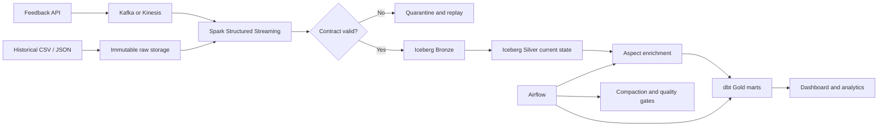

# Customer Feedback Intelligence Lakehouse

[](https://github.com/rishavsinghania01/customer-feedback-lakehouse/actions/workflows/ci.yml)

An end-to-end batch and streaming data platform for customer reviews. It accepts historical files and live events, preserves immutable raw data, validates a versioned contract, handles duplicates and late updates, enriches review text with aspect-level sentiment, and publishes tested analytical marts.

The repository includes a deterministic local pipeline that runs without cloud credentials and a production-shaped Spark, Iceberg and AWS path using the same data contract.

## What the system proves

- Idempotent batch ingestion using source-file and event content hashes
- Live event validation through FastAPI and Kafka-compatible publishing
- Spark Structured Streaming with checkpoints, watermarks and quarantine routing
- Iceberg Bronze, Silver and Gold layers with merge-based current state
- Aspect sentiment enrichment that keeps the supporting text clause
- Airflow maintenance orchestration and replayable backfill boundaries
- Incremental dbt facts, aggregates and warehouse tests
- Data-quality reconciliation, freshness-ready metadata and operational runbooks
- Terraform for encrypted AWS storage, Kinesis, Glue Catalog, EMR Serverless and replay queues
- Reproducible tests, linting, dbt builds, Terraform validation and image builds in CI

## Architecture



The detailed layer boundaries and invariants are in [docs/architecture.md](docs/architecture.md).

## Quick start: complete deterministic run

Python 3.11 or 3.12 is recommended.

```bash
python3.12 -m venv .venv
source .venv/bin/activate
pip install -e ".[dev,dashboard]"
make demo
make dbt
make test
```

The sample contains six events: five valid reviews, one invalid rating routed to quarantine, and one valid review older than the 24-hour watermark. The demo runs the same file twice. The second pass is skipped from its SHA-256 file hash, so Bronze and Silver counts do not change.

Inspect the output:

```bash
feedback-lakehouse report --database build/lakehouse.duckdb
LAKEHOUSE_DB=build/lakehouse.duckdb streamlit run app/dashboard.py
```

The dashboard opens at `http://localhost:8501`.

## Ingestion API

Start the API without a broker:

```bash
make api
```

Validated events are written to `runtime/api_inbox.jsonl`, which can be consumed by the batch command. When `KAFKA_BOOTSTRAP_SERVERS` is set, the same endpoint publishes idempotently configured Kafka messages instead.

```bash
curl -X POST http://localhost:8000/v1/feedback \
  -H 'content-type: application/json' \
  -d '{"review_id":"live-1","product_id":"phone-42","rating":2,"review_text":"The camera is great but the battery drains quickly.","source":"web","created_at":"2026-09-16T10:00:00Z","schema_version":1}'
```

`GET /v1/contract` returns the current JSON Schema. Invalid ratings, naive timestamps, unknown fields and unsupported schema versions are rejected at the boundary.

## Streaming development stack

Docker Compose defines Redpanda, Redpanda Console, MinIO, an Iceberg REST catalog, the ingestion API and an optional Spark stream.

```bash
docker compose up -d redpanda redpanda-init minio minio-init iceberg-rest ingestion-api
docker compose --profile streaming up spark-stream
```

| Service | URL |
|---|---|
| Ingestion API | `http://localhost:8000` |
| API contract | `http://localhost:8000/v1/contract` |
| Redpanda Console | `http://localhost:8080` |
| MinIO Console | `http://localhost:9001` |
| Iceberg REST catalog | `http://localhost:8181` |

See [docs/demo.md](docs/demo.md) for the duplicate, late-event and quarantine demonstration.

## AWS deployment

The Terraform module creates encrypted, private S3 buckets, a Kinesis stream, Glue Catalog database, EMR Serverless application, replay and dead-letter queues, CloudWatch logs and a least-scope execution role.

```bash
cd infra/terraform
cp terraform.tfvars.example terraform.tfvars
terraform init
terraform plan
terraform apply
```

`terraform apply` creates billable AWS resources. Review the plan and destroy development resources when the demonstration is complete.

## Data contract and correctness

The version-one contract requires a stable review and product key, a rating from one to five, review text, source, a timezone-aware creation timestamp and `schema_version=1`. Unknown fields are rejected. An optional `updated_at` controls current-state merges.

Executable invariants cover unique Silver keys, rating ranges, orphan aspect rows, complete Bronze processing outcomes and stale-update protection. Read [docs/data-contract.md](docs/data-contract.md) for the compatibility policy.

## Repository layout

```text
src/feedback_lakehouse/   contracts, API, local pipeline and enrichment
jobs/                     Spark streaming and finite enrichment jobs
dags/                     Airflow maintenance workflow
dbt/                      staging, facts, aggregates and tests
infra/terraform/          AWS infrastructure as code
app/                      local operational dashboard
tests/                    contract, API, enrichment and pipeline tests
docs/                     architecture, contract, demo and runbook
```

## Operational behaviour

- A repeated source file is skipped before parsing.
- A repeated event payload is ignored by its content hash.
- A newer review update replaces current Silver state; an older update is recorded as stale.
- Contract failures retain their complete original payload and error in quarantine.
- Late events remain queryable and are explicitly counted rather than silently discarded.
- Streaming ingestion is not placed inside Airflow. Airflow runs finite enrichment, compaction, dbt and quality jobs.

The incident and backfill procedures are documented in [docs/runbook.md](docs/runbook.md).

## Tests

```bash
ruff check .
pytest --cov=feedback_lakehouse --cov-report=term-missing
feedback-lakehouse demo --database build/lakehouse.duckdb
cd dbt && LAKEHOUSE_DB=../build/lakehouse.duckdb dbt build --profiles-dir .
```

## Current limitations

- The bundled sentiment component is deliberately transparent and lexicon-based. It is an enrichment example, not a general language model.
- The deterministic CI path uses DuckDB; scale and latency claims require a separately recorded Spark benchmark.
- The example deployment uses one AWS region and a single development Kinesis shard by default.
- Production environments should add private networking, customer-managed encryption keys, central identity, alert routing and a remote Terraform state backend.

## License

MIT
