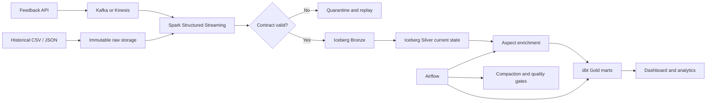

# Customer Feedback Intelligence Lakehouse

[](https://github.com/rishavsinghania01/customer-feedback-lakehouse/actions/workflows/ci.yml)

An end-to-end batch and streaming data platform for customer reviews. It accepts historical files and live events, preserves immutable raw data, validates a versioned contract, handles duplicates and late updates, enriches review text with aspect-level sentiment, and publishes tested analytical marts.

The repository includes a deterministic local pipeline that runs without cloud credentials and a production-shaped Spark, Iceberg and AWS path using the same data contract. The two paths share the contract, the hashing rules, the stale-update rule and the sentiment scorer, so a behaviour tested on one is the behaviour of the other.

## What the system proves

Every claim below is checked by a CI job on every push. The badge above is the current result.

| Behaviour | Where it is proven |
|---|---|
| A repeated source file is skipped by its SHA-256 before parsing; a repeated event is ignored by its content hash | `tests/test_pipeline.py`, and `make demo` running the sample twice |
| Invalid ratings, naive timestamps, unknown fields and unsupported schema versions are rejected at the API boundary with 422 | `tests/test_contracts.py`, `tests/test_api.py`, and the compose smoke test posting to the real API |
| An accepted event reaches the Kafka-compatible broker keyed by `review_id`, from one shared idempotent producer | `tests/test_api.py`; the `streaming-stack` CI job consumes it back from Redpanda with `rpk` |
| The Spark stream routes every Kafka record into exactly one of the valid or quarantine streams, with a named reason, including malformed JSON and null fields | `tests/test_spark_jobs.py` on a local SparkSession |
| Iceberg Bronze is append-only; Silver holds one current row per review and a stale update never overwrites a newer one; late events are flagged, not dropped | `tests/test_spark_jobs.py` running the real `MERGE INTO` against a local Iceberg catalog |
| Aspect sentiment matches whole words, not substrings, and keeps the supporting clause as evidence | `tests/test_sentiment.py`, `tests/test_spark_jobs.py` |
| The Airflow maintenance DAG imports, chains enrich, compact, dbt and gate in that order, contains no streaming task, and gates on the report exit code | `tests/test_dag.py` in the `dag` CI job |
| `feedback-lakehouse report` exits non-zero when any quality invariant fails, so the DAG's quality gate can actually fail | `tests/test_cli.py` |
| dbt staging, fact and aggregate models build and pass their tests on the pipeline output | `dbt build` in the `test` CI job |
| The Terraform module formats, initialises and validates | `terraform` CI job |

### Written and validated, but not executed in CI

- The Spark stream has not been run end to end against a live broker. Its parsing, validation, hashing, late flag and Iceberg merge are tested on a local session by feeding it frames shaped exactly like the Kafka source; the `readStream.format("kafka")` wiring and checkpoint recovery are not exercised.
- Terraform is validated, never applied. No AWS resource has been created from this module, so Kinesis, Glue Catalog and EMR Serverless are design, not evidence.
- The compose `streaming` profile (Spark container with MinIO and the Iceberg REST catalog) has not been brought up in CI. CI brings up Redpanda and the API only.
- No throughput or latency number is claimed anywhere. The DuckDB path is deterministic, not fast.

### Defects the tests found

Three behaviours were wrong before their tests existed, and the fixes are separate commits in the history:

- Aspect matching used substring search, so `because` matched the alias `use`, `flag` matched `lag` and `costume` matched `cost`, inventing aspects that were never mentioned. It now matches whole tokens plus a fixed inflection list.
- The Spark `validate` step filtered with `rating.between(1, 5)` and its negation. In Spark SQL a comparison with null is null, and null passes neither filter, so a row with a missing rating vanished from both streams. Every rule now tests null explicitly and the test asserts `valid + invalid == input`.
- `feedback-lakehouse report` printed failing checks and exited 0, so the Airflow quality gate that runs it could never fail. It now exits 1.

## Architecture



The detailed layer boundaries and invariants are in [docs/architecture.md](docs/architecture.md).

## Quick start: complete deterministic run

Python 3.11 or 3.12 is recommended.

```bash
python3.12 -m venv .venv
source .venv/bin/activate
pip install -e ".[dev,dashboard]"
make demo
make dbt
make test
```

The sample contains six events: five valid reviews, one invalid rating routed to quarantine, and one valid review older than the 24-hour watermark. The demo runs the same file twice. The second pass is skipped from its SHA-256 file hash, so Bronze and Silver counts do not change.

Inspect the output:

```bash
feedback-lakehouse report --database build/lakehouse.duckdb
LAKEHOUSE_DB=build/lakehouse.duckdb streamlit run app/dashboard.py
```

The dashboard opens at `http://localhost:8501`.

## Ingestion API

Start the API without a broker:

```bash
make api
```

Validated events are written to `runtime/api_inbox.jsonl`, which can be consumed by the batch command. When `KAFKA_BOOTSTRAP_SERVERS` is set, the same endpoint publishes idempotently configured Kafka messages instead.

```bash
curl -X POST http://localhost:8000/v1/feedback \
  -H 'content-type: application/json' \
  -d '{"review_id":"live-1","product_id":"phone-42","rating":2,"review_text":"The camera is great but the battery drains quickly.","source":"web","created_at":"2026-09-16T10:00:00Z","schema_version":1}'
```

`GET /v1/contract` returns the current JSON Schema. Invalid ratings, naive timestamps, unknown fields and unsupported schema versions are rejected at the boundary.

## Streaming development stack

Docker Compose defines Redpanda, Redpanda Console, MinIO, an Iceberg REST catalog, the ingestion API and an optional Spark stream.

```bash
docker compose up -d redpanda redpanda-init minio minio-init iceberg-rest ingestion-api
docker compose --profile streaming up spark-stream
```

| Service | URL |
|---|---|
| Ingestion API | `http://localhost:8000` |
| API contract | `http://localhost:8000/v1/contract` |
| Redpanda Console | `http://localhost:8080` |
| MinIO Console | `http://localhost:9001` |
| Iceberg REST catalog | `http://localhost:8181` |

See [docs/demo.md](docs/demo.md) for the duplicate, late-event and quarantine demonstration.

## AWS deployment

The Terraform module creates encrypted, private S3 buckets, a Kinesis stream, Glue Catalog database, EMR Serverless application, replay and dead-letter queues, CloudWatch logs and a least-scope execution role.

```bash
cd infra/terraform
cp terraform.tfvars.example terraform.tfvars
terraform init
terraform plan
terraform apply
```

`terraform apply` creates billable AWS resources. Review the plan and destroy development resources when the demonstration is complete.

## Data contract and correctness

The version-one contract requires a stable review and product key, a rating from one to five, review text, source, a timezone-aware creation timestamp and `schema_version=1`. Unknown fields are rejected. An optional `updated_at` controls current-state merges.

Executable invariants cover unique Silver keys, rating ranges, orphan aspect rows, complete Bronze processing outcomes and stale-update protection. Read [docs/data-contract.md](docs/data-contract.md) for the compatibility policy.

## Repository layout

```text
src/feedback_lakehouse/   contracts, API, local pipeline and enrichment
jobs/                     Spark streaming and finite enrichment jobs
dags/                     Airflow maintenance workflow
dbt/                      staging, facts, aggregates and tests
infra/terraform/          AWS infrastructure as code
app/                      local operational dashboard
tests/                    contract, API, CLI, enrichment, pipeline, Spark-job and DAG tests
docs/                     architecture, contract, demo and runbook
```

## Operational behaviour

- A repeated source file is skipped before parsing.
- A repeated event payload is ignored by its content hash.
- A newer review update replaces current Silver state; an older update is recorded as stale.
- Contract failures retain their complete original payload and error in quarantine.
- Late events remain queryable and are explicitly counted rather than silently discarded.
- Streaming ingestion is not placed inside Airflow. Airflow runs finite enrichment, compaction, dbt and quality jobs.

The incident and backfill procedures are documented in [docs/runbook.md](docs/runbook.md).

## Tests

The default suite needs only Python:

```bash
ruff check .
pytest --cov=feedback_lakehouse --cov-report=term-missing
feedback-lakehouse demo --database build/lakehouse.duckdb
cd dbt && LAKEHOUSE_DB=../build/lakehouse.duckdb dbt build --profiles-dir .
```

Two modules skip themselves unless their runtime is installed, and CI runs each in its own job:

```bash
# Spark jobs against a local Iceberg catalog. Needs a JVM; the Iceberg jar is fetched once.
pip install -e ".[spark]" && pytest tests/test_spark_jobs.py -v

# Airflow DAG import. Install Airflow with its constraints file first.
pytest tests/test_dag.py -v
```

CI runs five jobs: `test` (lint, unit and pipeline tests with an 85% coverage floor, the demo, dbt build, image build), `spark`, `dag`, `streaming-stack` (compose up Redpanda and the API, post a valid and an invalid event, read the valid one back off the topic) and `terraform`.

## Current limitations

- The bundled sentiment component is deliberately transparent and lexicon-based. It is an enrichment example, not a general language model, and it has no negation handling: "not bad" scores as negative.
- The Spark stream's Kafka source, checkpoint recovery and the compose `streaming` profile are not exercised by any test. See "Written and validated, but not executed in CI" above.
- The deterministic CI path uses DuckDB; scale and latency claims would need a separately recorded Spark benchmark, and none is made here.
- The Airflow DAG's dbt and quality-gate tasks run against the DuckDB pipeline output. There is no dbt-spark profile, so Gold marts are not built from the Iceberg tables.
- The example deployment uses one AWS region and a single development Kinesis shard by default, and has never been applied.
- Production environments should add private networking, customer-managed encryption keys, central identity, alert routing and a remote Terraform state backend.

## License

MIT
